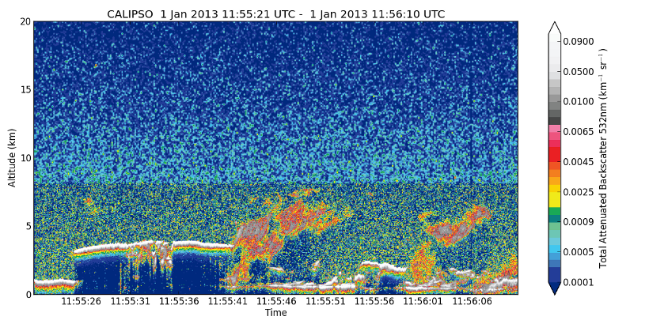
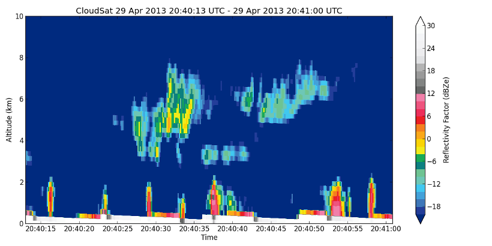

API (beta)
==========

**ccplot >= 1.5-rc5**

If the command-line program does not fulfill your needs,
you can use routines
provided with ccplot to make custom plots in python. These include routines
for reading HDF and HDF-EOS2 files, parsing time values and performing
data interpolation. See [API Reference](reference/) for details.

CALIPSO example
---------------

**Input file:**
[CAL_LID_L1-ValStage1-V3-01.2007-06-12T03-42-18ZN.hdf](https://sourceforge.net/projects/ccplot/files/products/CAL_LID_L1-ValStage1-V3-01.2007-06-12T03-42-18ZN.hdf)

**Source:** [calipso-plot.py](calipso-plot.py)





CloudSat example
----------------

**Input file:**
[2013119200420_37263_CS_2B-GEOPROF_GRANULE_P_R04_E06.hdf](https://sourceforge.net/projects/ccplot/files/products/2013119200420_37263_CS_2B-GEOPROF_GRANULE_P_R04_E06.hdf)

**Source:** [cloudsat-plot.py](cloudsat-plot.py)



